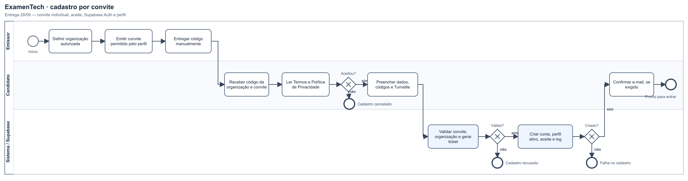
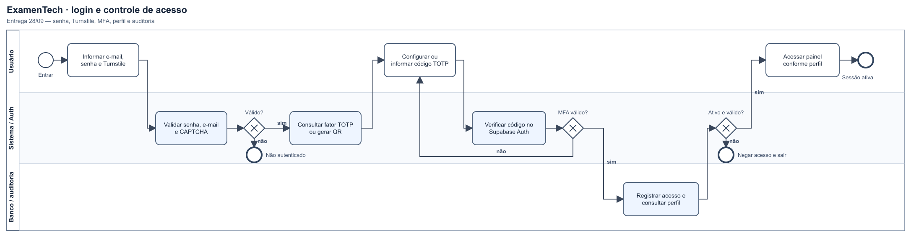

# ExamenTech-PFC2026
Projeto Final de Curso (PFC) — UMC, 2026 — Grupo 29.

## Modelagem BPMN

Foram adicionados à branch `main` dois diagramas BPMN. Os diagramas foram elaborados com base no código da branch `entrega2809`.

### Cadastro por convite

Representa a emissão e entrega manual do convite, o aceite dos Termos e da Política de Privacidade, a validação dos dados de cadastro, a criação da conta e a confirmação do e-mail quando exigida.

[Baixar o arquivo BPMN editável](examentech-entrega2809-cadastro.bpmn)

### Login e controle de acesso

Representa o login, a verificação pelo aplicativo autenticador (MFA), a consulta do perfil e da situação do usuário, o registro de auditoria e a liberação ou recusa do acesso.

[Baixar o arquivo BPMN editável](examentech-entrega2809-acesso.bpmn)

## Sobre os arquivos

Os arquivos `.png` permitem visualizar os fluxos diretamente no GitHub. Os arquivos `.bpmn` seguem o formato BPMN 2.0 e podem ser abertos em um editor compatível.

A inclusão destes diagramas na `main` documenta os processos; ela não aplica automaticamente configurações ou migrações no Supabase.
